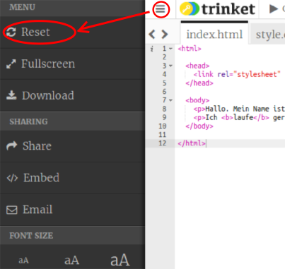
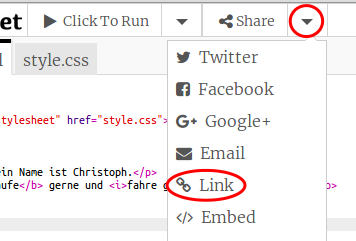

## Was ist HTML?

HTML steht für ** Hypertext Markup Language ** die Sprache, mit der Webseiten erstellt werden. Schauen wir uns ein Beispiel an!

Du wirst eine Website namens trinket.io verwenden, um HTML-Code zu schreiben.

+ Öffne dieses [trinket](http://jumpto.cc/web-intro){:target="_blank"}.

Das Projekt sollte so aussehen:


Der Code, den du auf der linken Seite siehst, ist HTML. Auf der rechten Seite des trinkets kannst du die Webseite sehen, die der HTML-Code gemacht hat.

HTML verwendet **Tags** um Webseiten zu erstellen. Schau dir diesen Code in Zeile 8 an:

```html
<p> Hallo. Mein Name ist Christoph. </p>
```

`<p>` ist ein Beispiel für ein Tag und eine Abkürzung für **Absatz**. Du kannst einen Absatz mit `<p>` beginnen und mit ` </p>` beenden.

+ Können Sie andere Tags finden?

## \--- collapse \---

## title: Lösung

Ein anderes Tag, das du vielleicht entdeckt hast, ist `<b>`, was für ** fett** steht:

```html
<b>laufe</b>
```

Hier sind noch einige:

+ `<html>` und `</html>` markieren den Anfang und das Ende des HTML-Dokuments
+ `<head>` und `</head>` ist der Bereich, in den CSS und ähnliches kommt (wir kommen später dazu)
+ `<body>` und `</body>` ist der Bereich für den Inhalt deine Website


\--- /collapse \---

+ Ändere etwas in einem der Textabsätze in der HTML-Datei (links). Klicke auf **Click To Run** und du solltest eine Änderung auf deiner Webseite sehen (auf der rechten Seite)!


+ Wenn du Fehler gemacht hast und alle Änderungen rückgängig machen möchtest, klicke auf das **Menü** und dann auf **Reset**.



Um nur das letzte, was du getan hast, rückgängig zu machen, kannst du die `Strg-Taste` gemeinsam mit ` z ` drücken.

### Du benötigst kein Trinket-Konto, um deine Projekte zu speichern!

Wenn du kein Trinket-Konto hast, klicke auf den **Pfeil hinunter** und dann auf **Link**. Dadurch erhältst du einen Link, den du speichern und später wiederherstellen kannst. Das musst du jedes Mal tun, wenn du Änderungen vorgenommen hast, da sich der Link ändert!



Wenn du ein Trinket-Konto hast, kannst du deine Webseite am einfachsten speichern, indem du auf den Knopf **Remix**, ganz oben am trinket, klickst. Dadurch wird eine Kopie des trinkets in deinem Profil gespeichert.

