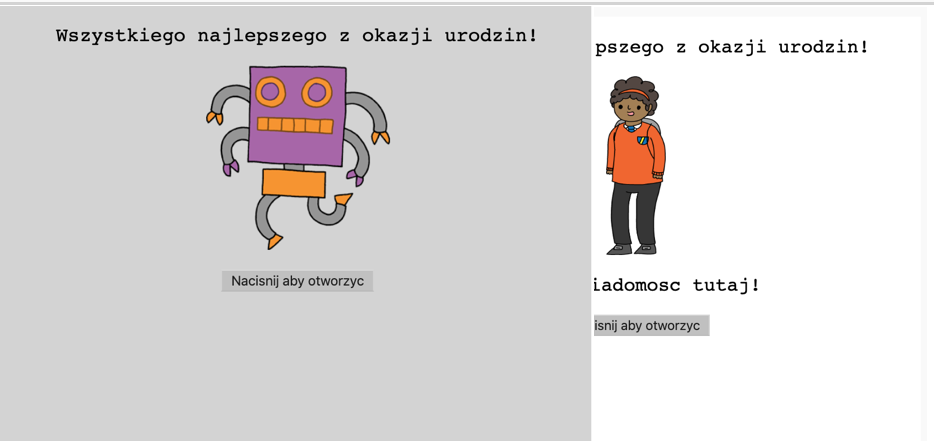

## Tworzenie kartki urodzinowej

Wykorzystajmy to, czego nauczyłeś się o HTML i CSS, aby stworzyć własną kartę urodzinową.

+ Otwórz [ten fragment kodu](https://trinket.io/html/6a79fc83bd){:target="_blank"}.

Napisaliśmy trochę kodu, abyś mógł zacząć, ale kartka urodzinowa wygląda jak dotąd dość nudnie, więc wprowadzimy pewne zmiany w kodzie HTML i CSS.

+ Naciśnij przycisk na przodzie kartki, aby zobaczyć jej wnętrze.

+ Przejdź do 14 wiersza kodu HTML. Spróbuj edytować tekst, aby spersonalizować kartkę.

+ Czy potrafisz znaleźć kod HTML dla obrazu robota i zmienić słowo `robot` na `sun`?

--- hints ---
 --- hint ---

+ Spójrz na linię 17, aby znaleźć kod.
+ Zmień słowo `robot` na `sun`, aby zobaczyć zmianę obrazu!

--- /hint ------ /hints ---

Możesz użyć dowolnego z tych słów `boy`, `diamond`, `dinosaur`, `flowers`, `girl`, `rainbow`, `robot`, `spaceship`, `sun`, `tea`, or `trophy` dla kartki urodzinowej, lub `cracker`, `elf`, `penguin`, `present`, `reindeer`, `santa`, lub `snowman` jeśli wolisz stworzyć kartkę świąteczną.

Możesz również edytować kod CSS kartki urodzinowej.

+ Kliknij zakładkę `style.css`. Pierwsza część to wszystkie style CSS ** na zewnątrz ** kartki.

+ Zmień kolor tła `background-color` na `lightgreen`.

+ Możesz także zmienić rozmiar obrazu. Przejdź do `#outside-pic` kodu CSS i zmień `width` i `height` obrazka zewnętrznego na `200px`(`px` oznacza piksele).

+ Czcionkę też możesz zmienić. Przejdź do `#outside-title` kodu CSS i zmień `font-family` na `Comic Sans MS` i `font-size` (rozmiar tekstu) na `16pt`.

Możesz użyć innych czcionek, na przykład:

+ `Arial`
+ `Impact`
+ `Tahoma`