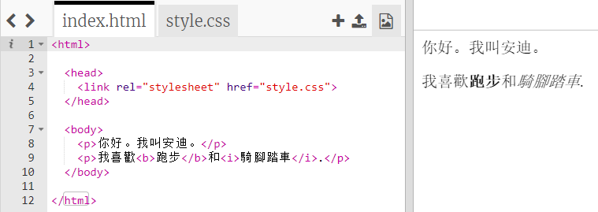
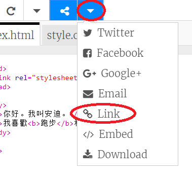

## HTML 是什麼？

HTML 代表**超文本標記語言（Hypertext Markup Language）**，是個用來製作網頁的語言。讓我們一起來看以下的例子吧！

你會用到一個叫做 trinket.io 的網站來編寫 HTML 代碼。

+ 打開[這個 trinket](https://trinket.io/html/3d390f9f7c){:target="_blank"}。

檔案看起來應該像這樣︰



如你所見，在 trinket 視窗左側是 HTML，右邊則是該 HTML 代碼作出來的網頁。

HTML 使用**標記（tag）**來建構網頁，在你的 HTML 的第 8 行找到以下代碼：

```html
<p>Hi. My name is Andy.</p>
```

`<p>` 是標記中的一種，代表一個**段落（paragraph）**。你可以用 `<p>` 開始段落，然後用 `</p>` 結束段落 。

+ 你能指出還有哪些標記嗎？

--- collapse ---
---
title: 答案
---

你可能會發現另一個標記 `<b>`，代表**粗體（bold）**：

```html
<b>跑步</b>
```

這裡還有更多例子：

+ `<html>` 和 `</html>` 標記了 HTML 文件的開始和結束
+ `<head>` 和 `</head>` 是用來放入 CSS 之類的東西 （之後我們會介紹）
+ `<body>` 和 `</body>` 裡面放的是你的網頁內容


--- /collapse ---

+ 修改左側 HTML 文件中的文本段落。按下 **Run**，你應該會看到右側的網頁跟著改變了！


+ 如果你寫錯了，或是想還原所有變更，可以點擊 **Menu** 按鈕，接著點擊 **Reset**。


如果你只是想復原上個動作，可以將 `Ctrl` 和 `z` 鍵一起按下。

### 您不需要 Trinket 的帳戶來保存您的專案！

如果你沒有 Trinket 帳戶，可以點擊**向下箭頭**圖示，然後點擊 **Link**。 它會為您提供一個連結，您可以先保存，稍後再回來。 每次進行更改時都需要執行此操作，因為連結將會改變！



如果您有 Trinket 帳戶，最簡單的方式是點擊上方的**Remix**按鈕。它會將存檔保存在您的帳戶中。

