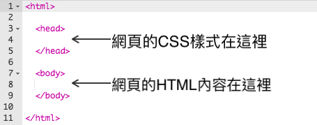
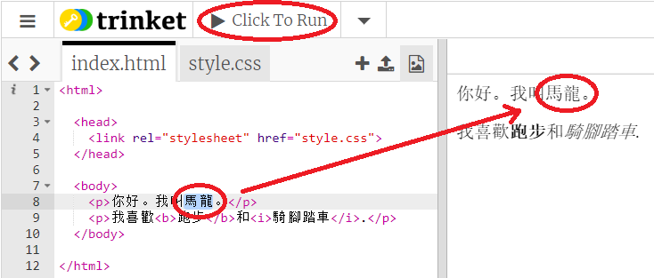
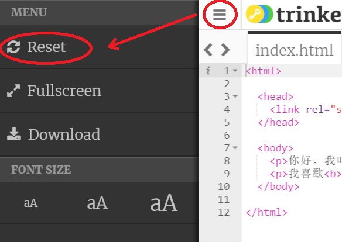

## 什麼是HTML？

HTML代表 **超文本標記語言**，是個用來製作網頁的語言。讓我們一起來看以下的例子吧！

您將使用名為trinket.io的網站編寫HTML代碼。

+ 打開 [這個 trinket](http://jumpto.cc/web-intro)。

檔案應該看起來像這樣︰


在左邊的程式碼是HTML。在 trinket 視窗的右邊，您可以看到該HTML程式碼組成的網頁。

HTML使用 **標籤** 來建構網頁。在程式的第8行找看看以下這行HTML程式碼：

```html
<p>Hi. My name is Andy.</p>
```

`<p>`是標籤的一個例子，代表一個**段落**。您可以使用`<p>`開始段落，並使用`</p>`結束段落 。

+ 你能找出其他的標籤嗎？

## \--- collapse \---

## title: 答案

您可能會發現另一個標籤 `<b>`，代表 **粗體**：

```html
<b>running</b>
```

這裡還有更多例子：

+ `<html>` 和 `</html>` 標記HTML檔案的開始和結束
+ `<head>` 和 `</head>` 是類似CSS的東西 (我們將在之後介紹)
+ `<body>` 和 `</body>` 裡面放的是您的網站內容



\--- /collapse \---

+ 對HTML文件中的文本段落(左側)進行修改。點擊 **Run**，您應該會看到您的網頁跟著改變了(右側)！



+ 如果您出錯了並想復原所有更改，您可以點擊 **Menu** 按鈕，然後點擊 **Reset**。



如果只想要撤銷最後一次操作，可以將 `Ctrl` 和 `z` 按鍵一起按下。

### 您不需要 Trinket 的帳戶來保存您的專案！

如果您沒有 Trinket 帳戶，請點擊向下箭頭，然後點擊 **Link**。 它會為您提供一個連結，您可以先保存，稍後再回來。 每次進行更改時都需要執行此操作，因為連結將會改變！


如果您有 Trinket 帳戶，最簡單的方式是點擊上方的** Remix **按鈕。它會將存檔保存在您的帳戶中。

